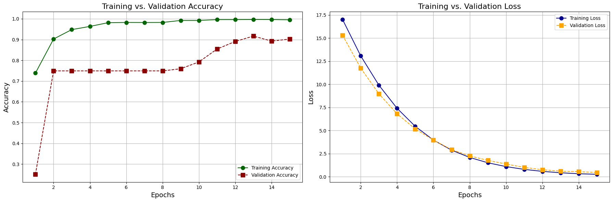

# Chest X-Ray Pneumonia Detector

A practical deep learning pipeline for automated detection of pneumonia from chest X-ray images using EfficientNetB4 and transfer learning. This repository provides the full workflow: dataset exploration, model training, evaluation, and visual interpretability for reproducible medical AI research and deployment.

## Project Structure

```
CHEST-XRAY-PNEUMONIA-DETECTOR/
├── data/
│   ├── dataset.txt
│   ├── dist_of_data.png      # Training label distribution
│   └── samples.png           # Random samples of X-ray images
├── notebooks/
│   └── chest_xray_effnetb4.ipynb   # Full notebook for end-to-end pipeline
├── outputs/
│   └── output_model.txt      # Model summary and training logs
├── results/
│   ├── confusion_matrix.png      # Confusion matrix on test data
│   ├── pred_test_samples.png     # Test set predictions visualized
│   └── train_val_loss_acc.png    # Training & validation curves
├── .gitattributes
├── LICENSE
└── requirements.txt
```

## Dataset Overview

* **Source:** Public Chest X-ray dataset (see `data/dataset.txt` for citation or download link)
* **Classes:**

  * `PNEUMONIA`
  * `NORMAL`
* **Image Shape:** Grayscale images resized to 128x128 and converted to RGB (3 channels).
* **Distribution:**

  * `PNEUMONIA`: 3875 (74.3%)
  * `NORMAL`:   1341 (25.7%)

See `data/dist_of_data.png` and `data/samples.png` for data insights.

## Approach

* **Data Preparation:**

  * Preprocessing: Resizing, grayscale to RGB conversion, normalization
  * Stratified train/validation/test split
  * Heavy data augmentation (rotation, zoom, flip, shear) to combat imbalance
* **Model:**

  * **Backbone:** EfficientNetB4 (transfer learning, ImageNet weights)
  * Regularized dense layers, batch normalization, dropout
  * Optimizer: Adam, LR scheduling, early stopping, class balancing
* **Training:**

  * 15 epochs, batch size 64
  * Class weights auto-computed for imbalanced data
  * Monitoring accuracy/loss on validation set

## Results

* **Accuracy (Test Set):** \~88.3% (see notebook for up-to-date value)
* **Key metrics:** See confusion matrix and classification report in the notebook and `results/confusion_matrix.png`
* **Visualization:**

  * Training vs. validation accuracy/loss curves: `results/train_val_loss_acc.png`
  * Confusion matrix: `results/confusion_matrix.png`
  * Random test predictions: `results/pred_test_samples.png`

| Metric                | Value |
| --------------------- | ----- |
| Test Accuracy         | 88.3% |
| Precision (Normal)    | 82.0% |
| Recall (Normal)       | 99.5% |
| Precision (Pneumonia) | 98.7% |
| Recall (Pneumonia)    | 63.7% |

*Numbers are indicative. See full report for details.*

## Quickstart

**Requirements:** See `requirements.txt` for dependencies. Requires Python 3.8+, TensorFlow 2.x, Keras, OpenCV, scikit-learn, seaborn, matplotlib, pandas, etc.

### 1. Setup

```bash
pip install -r requirements.txt
```

### 2. Data

* Download and extract the Chest X-ray dataset (see `data/dataset.txt`).
* Organize the folders as:

  * `data/train/PNEUMONIA/` and `data/train/NORMAL/`
  * `data/test/PNEUMONIA/` and `data/test/NORMAL/`

### 3. Training & Evaluation

* Run the notebook: `notebooks/chest_xray_effnetb4.ipynb`
* Output weights, confusion matrix, and visualizations will be saved in `outputs/` and `results/`.

### 4. Inference

```python
from tensorflow.keras.models import load_model
import cv2, numpy as np

model = load_model('EffNet4_Pneumonia.h5')
img = cv2.imread('example_chest_xray.png', cv2.IMREAD_GRAYSCALE)
img = cv2.resize(img, (128,128))
img = np.expand_dims(img, axis=-1)
img = np.repeat(img, 3, axis=-1) / 255.0
img = np.expand_dims(img, axis=0)
pred = model.predict(img)
print("Pneumonia" if pred[0][0]>0.5 else "Normal")
```

## Visual Summary

* 
* 
* 
* 
* 

## Reproducibility & Limitations

* Results may vary with different data splits or hardware.
* Current pipeline is for research; not for clinical deployment without further validation.
* The dataset is imbalanced; see code for how class weighting and augmentation are used to mitigate this.

## Citation

If you use this code or model, please cite the original dataset (see `data/dataset.txt`) and reference this repository.

---

**Contact**: For questions, create an issue or contact the maintainer via GitHub.
